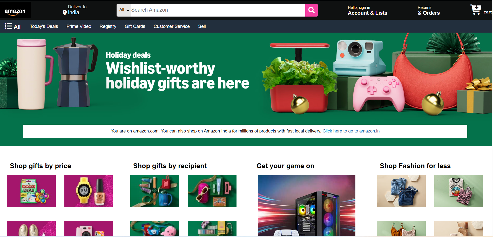

# Amazon Clone

This is a simple *Amazon homepage clone* created using *HTML and CSS*.  
The project focuses on layout structure, UI design, and basic styling similar to the Amazon website.

⚠️ *Note:* This project is *not responsive* and is best viewed on desktop screens.

---
## Live Demo

Click here for demo - https://gulfamkhan77309.github.io/Amazon-clone/

## 📸 Screenshots
()

## 🛠 Technologies Used
- HTML5
- CSS3
- Flexbox
- Basic layout techniques

---

## ✨ Features
- Amazon-style header and navigation bar
- Product sections with images and text
- Clean and simple UI design
- Desktop layout structure

---

## 🚀 How to Use
1. Download or clone the repository
2. Open index.html in any web browser
3. View the project on a desktop or laptop for best experience

---

## 📚 What I Learned
- Structuring large web pages using HTML
- Styling layouts using CSS
- Using Flexbox for alignment
- Understanding real-world UI cloning

---

## ❌ Limitations
- The website is *not responsive*
- Not optimized for mobile or tablet screens
- No JavaScript functionality added

---

## 🔮 Future Improvements
- Make the website fully responsive
- Add JavaScript for interactivity
- Improve accessibility and performance

---

## 👤 Author
*Gulfam Khan*  
GitHub: https://github.com/gulfamkhan77309